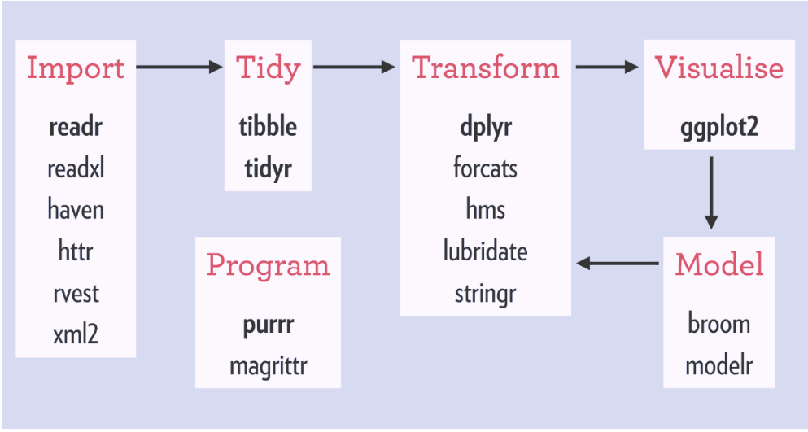
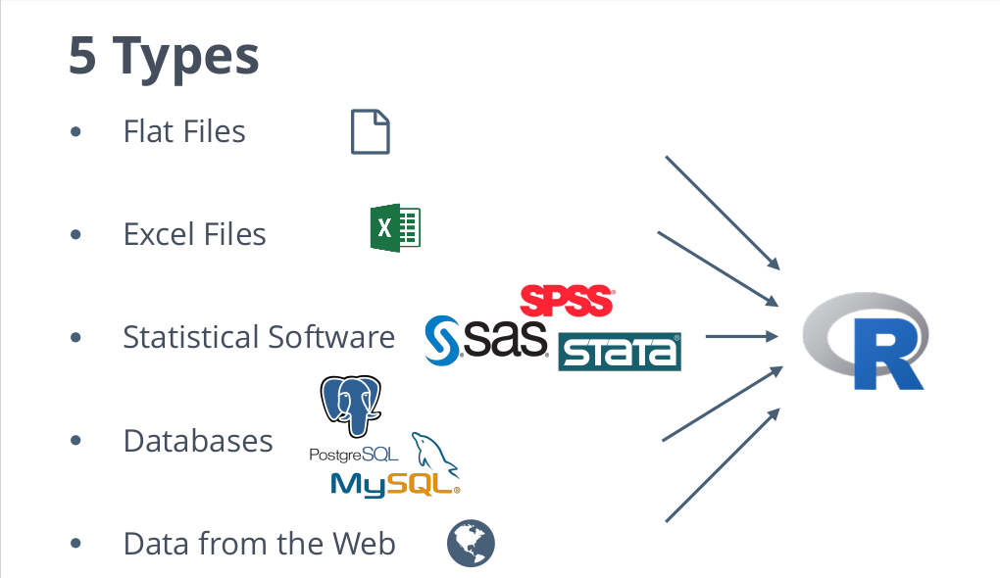

# R for Data Science ?

##

*Data science is an exciting discipline that allows you to turn raw data into understanding, insight, and knowledge.*   

*The goal of “R for Data Science” is to help you learn the most important tools in R that will allow you to do data science.*   

Hadley Wickham, from [R for Data Science](http://r4ds.had.co.nz) Book  


## Key steps in R4DS 

You need to first identify the most important steps in Data Science.  


 

## Key tools (packages) in R4DS

The most important packages uses 



# Data Visualisation

## Data Visualisation

* [The layered grammar of graphics](http://vita.had.co.nz/papers/layered-grammar.pdf) 

* ggplot2 (include in tidyverse package)  

```{r, message=FALSE, warning=FALSE, fig.dim = c(6,6)}
#install.packages("tidyverse")
library(tidyverse)
library(dslabs)
data(gapminder)
```

## Ggplot() function

* You begin a plot with the `ggplot()` function. This function create a coordinate system like this.  

```{r, fig.align='center', fig.dim = c(6,4)}
ggplot(data = gapminder)
```

## Geom functions

* Geom function add layers on graph like `geom_point()` add a layer of points.

```{r, fig.dim = c(6, 4), fig.align='center', message=FALSE, warning=FALSE}
ggplot(data = gapminder) + geom_point(mapping = aes(x = fertility, y = life_expectancy))
```

# Data transformation

## Dplyr 

Five _verbs_ of data manipulation (transformation):

* `filter()` : Pick observations by their values.  
```{r, eval=FALSE}
gapminder %>%
  filter(year == 1990)
```

* `arrange()` : Reorder the rows.  
```{r, eval=FALSE}
gapminder %>%
  arrange(continent)
```

* `select()` : Pick variables by their names.  
```{r, eval=FALSE}
gapminder %>%
  select(country, gdp, fertility, year, region, continent)
```

## Dplyr 

* `mutate()` : Create new variables with functions of existing variables.  
```{r, eval=FALSE}
gapminder %>%
  mutate(pop_per_millions = population / 10^6) 
```

* `summarise()` : Collapse many values down to a single summary.  
```{r, eval=FALSE}
gap_sum <- gapminder %>%
  select(country, gdp, life_expectancy, fertility, year, continent)
gap_sum <- group_by(gap_sum, year, continent)

summarise(gap_sum, gdp_cont = mean(gdp, na.rm = TRUE)) 
```

# Data Import

## Types of files



## libraries 

* Utils `read.table`

* Hadley's `readr`

* Matt & Arun's `data.table`

* Jenny's `readxl`

## Examples

```{r eval=FALSE}
# read.table 
data_name <- read.table("path_to_file.csv", header = TRUE, sep = ",", stringsAsFactors = FALSE)
```

```{r eval=FALSE}
library(readr) 
data_name <- read_delim('path_to_file.txt')
```

```{r eval=FALSE}
library(data.table) 
data_name <- fread('path_to_file.csv')
```

```{r eval=FALSE}
library(readxl) 
data_name <- read_excel('path_to_file.xlsx')
```


# Tidy data

## Tidy data

1. Each variable forms a column.  

2. Each observation forms a row.  

3. Each type of observational unit forms a table.  

## Tidy data


## Verbs for tidying

* `gather()` : join variables spread in non-variable columns into column key-value pair.  

* `spread()` : is the opposite of gathering.  

* `separate()` : pulls apart one column into multiple columns, by splitting wherever a separator character appears.  

* `unite()` : The inverse of `separate()`. 

I recommend to take a look at `vignette("tidy-data")`

## Arrange a messy dataset

```{r}
library(readxl)
age_marriage <- read_excel("~/Downloads/indicator age of marriage.xlsx")

tidy_age_marriage <- age_marriage %>%
  gather(year, age, -X__1) 
```

## Arrange a messy dataset

```{r}
head(age_marriage)
```

## Arrange a messy dataset

```{r}
head(tidy_age_marriage)
```

## What Else ?

We left __model__, __program__ and __communication__ modules for next workshop!


# Helpful links

## 

* R for Data Science, http://r4ds.had.co.nz

* Data Camp, https://datacamp.com

* Create a twitter account and follow the __#rstats__ tag.

* The repo of this workshop, https://github.com/Ebedthan/r4ds_aru

* Follow me on twitter, @anicetebou


# R Consortium and the R Community Code of Conduct

##      


__Open__: Members of the community are open to collaboration, whether it's on projects, working groups, packages, problems, or otherwise.  

__Considerate__: Members of the community are considerate of their peers, other R users.  

__Respectful__: Members of the community are respectful.  

Overall, we're good to each other. We contribute to this community not because we have to, but because we want to.  

# Thanks!

## R Consortium

## Slides created with the R package [**revealjs**](https://revealjs.com)  

## You ! {data-background="./img/thanks.gif"}
